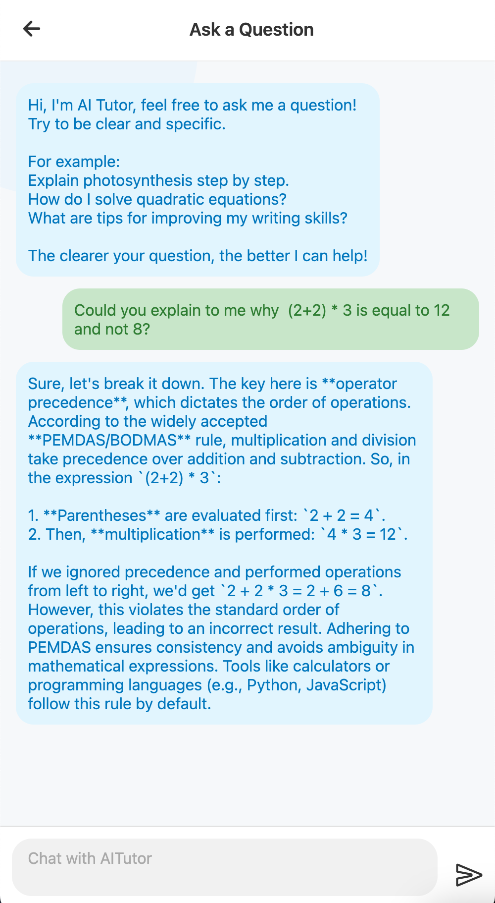

# 📚 AiTutor — Personalized AI-Powered Learning Platform

> AiTutor adapts lessons in real time to each student’s learning ability—making learning fun, personalised, and data-driven for students and teachers alike. AiTutor also allows distant learning at students' own free time and restricted to certain school hours; this can cater to students in different regions, making learning more flexible.

---

## 🚀 Overview

**AiTutor** is an **AI-powered adaptive learning platform** designed to personalize education in real-time based on a student’s **progress**, **learning style**, and **confidence level**. The system also provides **teachers** with an intuitive dashboard that gives live analytics to identify struggling students and intervene early with targeted support.

---

## 👥 Team Members

| Name                                            | Role           | Responsibilities           |
| ----------------------------------------------- | -------------- | -------------------------- |
| [jinghaochua](https://github.com/jinghaochua)   | Frontend       | React Native, UI           |
| [w3joe](https://github.com/w3joe)               | Frontend       | React Native, UI, Docker   |
| [GordonWong03](https://github.com/GordonWong03) | Backend        | Java Spring Boot, Firebase |
| [WeiJie03](https://github.com/WeiJie03)         | Infrastructure | Docker, Data Generation    |

---

## 🛠️ Tech Stack

| Layer        | Tools / Libraries           |
| ------------ | --------------------------- |
| **Frontend** | React Native                |
| **Backend**  | Java Spring Boot, Docker    |
| **Database** | Firebase (Auth + Firestore) |
| **AI/ML**    | Cohere AI API               |
| **Storage**  | Cloudinary                  |
| **Testing**  | Postman                     |

---

## 📌 Chosen Problem Statement

In every classroom, there are students who fall behind—not because they're less capable, but because they learn differently. Some need more time, others need more visuals, and a few just need someone to understand how they think. Traditional education often takes a one-size-fits-all approach, leaving these students underserved and unnoticed.

AiTutor was born from a simple belief: **every student deserves a learning experience tailored to them**. We wanted to reimagine education as something dynamic, personal, and compassionate. By combining the power of AI, real-time analytics, and thoughtful design, AiTutor adapts to the unique pace and style of each learner—whether they thrive with visuals, learn best by doing, or need encouragement along the way.

Our goal isn’t just to teach — it’s to help students feel seen, supported, and empowered in their learning journey.

---

## ✨ Features

### - 🔐 Secure registration and login screens

<p float="left">
  
  
</p>
<p>
  <em>User can register for an account as a teacher or student.</em>
</p>

### - 🎨 Beautiful and intuitive mobile interface

<p float="left">

  
  
</p>
<p>
  <em>Courses can be filtered by topics or queried using the search bar.</em>
</p>

### - 🏆 Accessible content to well-structured courses

<p float="left">


</p>
<p>
  <em>Lessons are completed sequentially, and users can choose to retake a lesson to refresh their memory.</em>
</p>

### - 💬 AI Q&A chat for real-time support

<p float="left">

</p>
<p>
  <em>AiTutor tailors responses based on the user's proficiency level.</em>
</p>

### - 🧠 Adaptive lessons with dynamic quiz difficulty based on previous results

<p float="left">


</p>
<p>
  <em>Result is calculated based on confidence level and correct answers. This will determine the next lesson's difficulty based on the users' proficiency.</em>
</p>

### - 📊 Analytics dashboard for teachers to monitor performance

<p float="left">


</p>
<p>
  <em>Teachers can manage their classes in a dashboard, where they can monitor their students' progress.</em>
</p>
<p float="left">


</p>
<p>
  <em>Using the dashboard, they can also create new class, courses and add students to classes.</em>
</p>

---

## 🧩 How It Works

AiTutor uses a rule-based algorithm to adapt:

- **Lesson difficulty** based on quiz accuracy & confidence levels
- **Presentation mode** based on preferred learning styles (visual, auditory, kinesthetic)
- **Teacher analytics** to show students at different proficiency levels

The backend handles lesson delivery and scoring, while the frontend adapts dynamically based on user data and feedback.

---

## 🏁 Getting Started

To get the project running locally, clone both frontend and backend:

### 🔷 Frontend (React Native)

```bash
cd frontend
npm install
npx expo start
```

### 🔸 Backend (Java Spring Boot)

```bash
cd backend
mvn clean install
mvn spring-boot:run
```

- Note that a firebase-adminsdk json and Cohere api key is required in src/main/resources for the application to work
